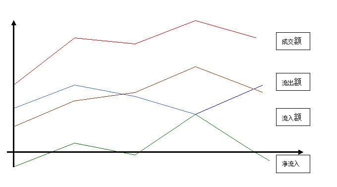

# 数据分析统计软件初步需求


一、基本量价关系
成交量（或成交金额）等于买入量加卖出量，净买量等于买入量减卖出量，是价格变化的关键。因此分析净买量变化是最基本目的。使用中一般用数量或金额表示。数量乘以股价等于金额，成交金额比流通市值乘以百分之百称换手率。


二、净流入（金额）
净流入近似等于净买量乘以成交价，由于成交价在开盘价正负百分之十间变化，用净流入更方便。统计一个时段的净流入多少有重要参考价值。问题是个股流通盘（或流通市值）差别很大可达千百倍，实际常用的是相对流量，相对流量等于某股净流入比成交金额（或换手率乘以流通市值）乘以百分之百。

三、大宗流入
按每笔成交额大小，分为小单、中单和大单。其中小单为散户行为出入基本互相抵消，中大单代表主力机构行为，是统计的重点。大宗流量道理同上。

四、数据单位
数据统计重在趋势和简洁清晰金额单位最好用亿或万元，日期最好用年月日。个股代码和名称最好同时显示。

五、初心是通过统计排序找到机构建仓的个股，因此通过数据或数据排序找个股是重点。





## important relationships

```
成交量 = 流入量 + 流出量
净流入量 = 流入量 – 流出量
成交额 = 流入额 + 流出额
净流入 = 流入额 – 流出额
换手% = 成交量 / 流通股

相对流量% = 净流入 / 成交额
大宗流量% = 大宗流入 / 成交额

净流入 ~ 净流入量 * 成交价
```


## 计算步骤：

```
成交额 = 净流入 / 相对流量%
流入额 = （成交额 + 净流入）/ 2
流出额 = （成交额 – 净流入）/ 2

成交量 = 流通股 * 换手%
成交量 ~ 成交额 / 成交价
流入量 ~ 流入额 / 成交价
流出量 ~ 流出额 / 成交价
```


